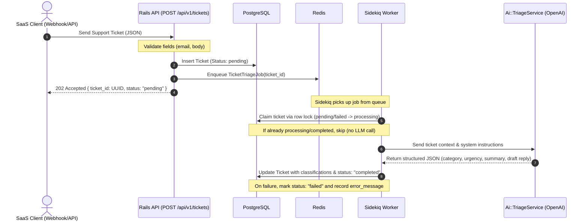

# System Architecture: AI Support Ticket Triage

This document describes the architecture of the AI Support Ticket Triage service: a headless, API-only Rails application that ingests support tickets and classifies them with an LLM in the background. The design goal is a reliable, well-tested, and extensible service whose trade-offs and current limitations are documented explicitly (see [§6 Limitations & Trade-offs](#6-limitations--trade-offs)).

---

## 1. High-Level Flow (Request/Response & Async Processing)

---

## 2. Component Breakdown

### A. Rails API Layer (Controller)
* **Endpoint**: `POST /api/v1/tickets`
* **Format**: JSON
* **Responsibility**: Ingest tickets quickly. Minimize processing time on the web server thread. Offload heavy lifting to Sidekiq immediately.
* **Return status**: `202 Accepted` to allow clients (like webhooks) to disconnect without waiting for LLM completion.

### B. Persistence Layer (PostgreSQL)
* **Primary Key**: UUID (avoids sequential ID exposure and enumeration; generated by `gen_random_uuid()` via the `pgcrypto` extension).
* **Schema (`tickets`):**
  * `id`: `uuid` (Primary Key)
  * `external_id`: `string` (**unique index**, blank normalized to `NULL`; anchors idempotent ingestion)
  * `customer_email`: `string` (required, format-validated)
  * `subject`: `string` (nullable)
  * `body`: `text` (required)
  * `status`: `string` (enum: `pending`, `processing`, `completed`, `failed`; indexed)
  * `category`: `string` (nullable; length-bounded to 50 — the schema keeps the vocabulary open)
  * `urgency`: `string` (nullable; validated against `Ticket::URGENCIES` = `low`, `medium`, `high`, `urgent`)
  * `summary`: `text` (nullable)
  * `suggested_reply`: `text` (nullable)
  * `metadata`: `jsonb` (arbitrary client key-values; defaults to `{}`)
  * `error_message`: `text` (last failure message, for dashboard/debugging)
  * `timestamps`

### C. Background Job Layer (Sidekiq + Redis)
* **Technology**: Sidekiq on Redis, driven through Active Job (`config.active_job.queue_adapter = :sidekiq`).
* **Retry Strategy**: Sidekiq is the **single** retry authority (`sidekiq_options retry: 3`, exponential backoff). Errors are classified in the service layer: **transient** failures (rate limits, 5xx, timeouts, connection resets) are re-raised so Sidekiq retries; **permanent** failures (4xx, auth, model refusal, malformed/incomplete output) are recorded and swallowed so no retry is attempted. This caps LLM spend on failures that cannot succeed.
* **Error Handling**: Every failure records its message to `error_message` with a `failed` status. A ticket deleted before processing is skipped without a retry. See [§3 Failure Handling Behavior](#3-failure-handling-behavior).

### D. Service Layer (AI Client Integration)
* **Design Pattern**: Service Object (`Ai::TriageService`), invoked as `Ai::TriageService.call(ticket)`.
* **Responsibility**: Encapsulates all prompt construction, the JSON schema, LLM communication, and error classification.
* **LLM Strategy**: Structured Outputs (`response_format: json_schema`, `strict: true`) keep responses parsing-safe. The `urgency` enum and the `required` field list are driven by `Ticket::URGENCIES` and `Ai::TriageService::REQUIRED_FIELDS` — the same constants used to validate on write — so the model contract and the DB validation cannot drift. Output that is missing or blanks a required field is rejected as a permanent failure rather than persisted.
* **Resilience**: A 15s request timeout (`config/initializers/openai.rb`) prevents hanging worker threads; a timeout is classified transient and retried.
* **Observability**: Each LLM call and job outcome emits a structured logfmt line (`event`, `ticket_id`, `model`, `outcome`, `duration_ms`, `error_class`). Logging is intentionally lightweight — no APM/tracing stack. Ticket content is never logged, and PII-bearing request parameters are filtered from Rails logs.

---

## 3. Failure Handling Behavior

Failures are classified in `Ai::TriageService` and acted on in `TicketTriageJob`. Sidekiq is the only thing that retries; the job simply chooses whether to re-raise.

| Failure | Classified as | Job action | Sidekiq retries? | Resulting state |
|---|---|---|---|---|
| Rate limit (429) | Transient | record, re-raise | Yes (≤ 3) | `failed`, then recovers on a successful retry |
| Server error (5xx) | Transient | record, re-raise | Yes | `failed` → recovers |
| Timeout / connection reset | Transient | record, re-raise | Yes | `failed` → recovers |
| Bad request (400 / 422) | Permanent | record, swallow | No | `failed` |
| Auth error (401 / 403) | Permanent | record, swallow | No | `failed` |
| Model refusal | Permanent | record, swallow | No | `failed` |
| Malformed or incomplete output | Permanent | record, swallow | No | `failed` |
| Unknown / unexpected error | Transient (default) | record, re-raise | Yes | `failed` → recovers |
| Ticket deleted before processing | `RecordNotFound` | skip | No | (row gone) |
| Duplicate concurrent worker | — | skip via row lock | n/a | unchanged (no second LLM call) |

On every retry the ticket is re-claimed (`pending`/`failed → processing`) and reprocessed. On the terminal outcome the ticket is either `completed` or `failed` with the last `error_message`.

---

## 4. Engineering Decisions

* **Sidekiq is the single retry authority.** Active Job's `retry_on` and Sidekiq's `sidekiq_options retry:` both count attempts; using both splits the policy across two frameworks and double-counts. We keep one authority — Sidekiq — and express "do not retry" simply by **not re-raising**. Backoff and the Dead Set therefore behave predictably.
* **Postgres row locking for idempotency and concurrency (not Redis/Redlock/outbox).** The database is already the transactional source of truth. A `SELECT … FOR UPDATE` claim gives correct single-flight semantics with zero additional infrastructure and none of the failure modes of distributed locks. The lock is held only for the fast state transition, never across the LLM call. Redlock, an outbox, or a streaming bus would add operational surface for a guarantee Postgres already provides.
* **Idempotent ingestion via a unique index.** Deduplication is enforced at the one layer that can do it atomically — the database. The controller returns the existing record on a duplicate `external_id` and rescues the concurrent-insert race.
* **Fail-closed shared-token auth.** An unconfigured server rejects every request (`503`) rather than falling back to a default; tokens are compared in constant time. A single shared token is a deliberate MVP scope; per-client keys are future work.
* **WebMock contract tests over full client stubbing.** Stubbing the whole OpenAI client hid the real request shape and the Faraday `:raise_error` middleware that error classification depends on. WebMock exercises the true HTTP boundary: the outgoing request body is asserted against our schema, and real HTTP status codes drive classification — so the tests validate the contract, not our own mock.
* **Observability scope and non-goals.** Structured logfmt lines (keyed by `ticket_id`, with request timing) give greppable visibility without an APM stack. This is intentional: the ticket row is the source of truth for outcomes. Non-goals for now: distributed tracing, a metrics pipeline, and per-request correlation IDs across the API → job boundary.

---

## 5. Testing Strategy & Proven Properties

The suite is layered: model validations, API integration tests, service HTTP-contract tests (WebMock), job-behavior tests, and a real two-thread concurrency test.

**Proven by the suite:**
* Idempotent ingestion — a duplicate `external_id` creates no second row and enqueues no second job.
* **Exactly one LLM call under concurrent workers** — two threads contend for one ticket and only one triage call is made. The test is validated to *fail* if the row lock is removed, so it is not a tautology.
* Transient vs. permanent classification driven through the **real Faraday middleware** (429/5xx/timeout → transient; 400/401/403 → permanent).
* Permanent failures do not retry; transient failures re-raise for Sidekiq.
* Malformed JSON, model refusal, empty content, and missing/blank required fields are all rejected (never persisted).
* The 15s request timeout is configured; structured logs are emitted without ticket content; PII request parameters are filtered.

**Deliberately not covered (honest scope):**
* Sidekiq's live attempt-counting and Dead Set require Redis and are not exercised in the unit suite; the `retry: 3` configuration and the job's per-attempt contract are asserted instead.
* No load/performance testing.
* LLM output *accuracy* is not asserted — the system guarantees a schema-valid, complete response is persisted, not that the classification is correct.

---

## 6. Limitations & Trade-offs

1. **Stuck `processing` on worker crash.** A ticket claimed and then abandoned (worker killed mid-flight) remains `processing` and is skipped by future claims. There is no lease/heartbeat reclaim yet.
2. **Permanent failures are not placed in Sidekiq's Dead Set.** They are recorded on the ticket (`failed` + `error_message`) and swallowed by design — the ticket row, not Sidekiq, is the failure source of truth.
3. **Single shared auth token.** Not per-client; no rotation.
4. **Retry exhaustion is verified at the config + job-contract level**, not via a live Sidekiq/Redis integration test.
5. **`category` vocabulary is open** (only length-bounded); a novel-but-plausible category persists as-is.
6. **No cross-boundary correlation ID** — logs correlate by `ticket_id` only.
7. **LLM correctness is not guaranteed** — the system guarantees a schema-valid, complete response is persisted, not that the classification is accurate.

## 7. Future Enhancements

1. **Per-client authentication**: issue and rotate a distinct API key per client.
2. **Webhooks**: dispatch a callback when a ticket reaches `completed` or `failed`.
3. **Stuck-worker recovery**: a lease/heartbeat with a reclaim window (addresses Limitation 1).
4. **LLM provider fallback**: fail over to an alternate provider on sustained OpenAI errors.
